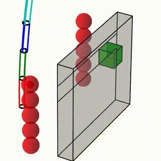

Neural CEDF for Continuum Robot Control [[Paper]](https://arxiv.org)
===========================================


|   |   |   |
|:---:|:---:|:---:|
|  |  |  |
|   |   |   |
|  |  |  |

This repository contains the official implementation for the paper "Neural Configuration Distance Function for Continuum Robot Control".

<!-- If you find our work useful, please consider citing our paper:
```
@article{}
``` -->


## 🚀 Quick Start
Clone the repository: 

```
git clone https://github.com/cps-atlas/ndf-coroco.git
cd ndf-coroco
```

## 📦 Dependencies
This code has been tested on Ubuntu 22.04 LTS. To set up the environment:

```
conda create -n environment.yaml
conda activate soft_neural_cedf
```

You can install miniconda from [here](https://docs.conda.io/en/latest/miniconda.html). 

## 🧠 Neural CEDF Training

To train the neural CEDF, run the file:
```
main_cedf.py
```
The training parameters can be adjusted in training/config_3D.py. 


To evaluate and visualize the learned CEDF model, run the file: 
```
evaluate_heatmap.py, evaluate_2d_sdf_slice.py
```

*   Default training dataset is saved in training_data/
*   To customize the training dataset for different continuum robot link size, modify robot_config.py (e.g., LINK_RADIUS, LINK_LENGTH), and run the file:

```
training_data/data_prepare_3D_link.py
```
    
to prepare the dataset for the customized continuum robot link. 


## 🤖 Continuum Robot Safe Motion Planning with MPPI 

Note: The MPPI algorithm is computationally expensive. For real-time performance, we recommend using an NVIDIA RTX 3090 GPU or better. If no GPU is available, uncomment the following line in the relevant scripts:

```
jax.config.update('jax_platform_name', 'cpu')
```


1. Dynamic Environment with Multiple Spheres, run the file
```
main_control_sphere.py
```

2. Cluttered Environment with multiple obstacles: 
```
main_control_cluttered.py
```

3. Charging Port Application: 
```
main_control_charging.py
```

Add --no_interactive flag to disable the interactive window for all the above navigation simulations:
```
python main_control_sphere.py --no_interactive
```

Customize simulation settings in robot_config.py: 
*  Number of robot links
*  Environment details (number of spheres, number of environments, ...)


Note: In our simulations, we rely solely on the current observations of dynamic obstacles without explicitly predicting their future trajectories. More advanced techniques could be integrated in future work to improve dynamic obstacle handling.


The default N-CEDF model for navigation simualtion is trained_models/torch_models_3d/grid_search_moe_4_16.pth

## 📊 Results

Simulation videos: results_videos_sphere/, results_videos_cluttered/ , and results_videos_charging/ . 

Distance plots: distance_plots/

